# 12 — Workflows, Pipelines & Diagrams

> Mermaid diagrams in this file are normative architectural communication aids. If implementation differs materially, update SSOT/ADR first.

## 1. System Context

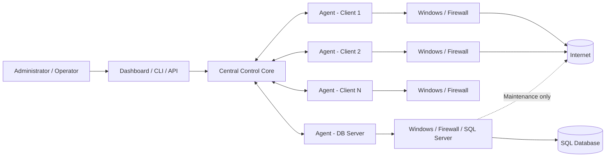

## 2. Component Diagram

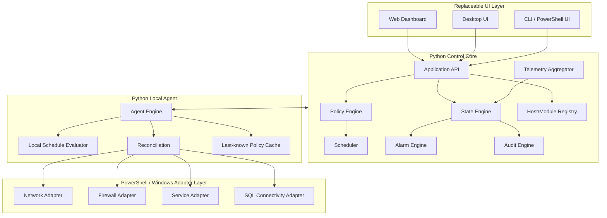

## 3. Policy Change Pipeline

```mermaid
flowchart LR
    Request[Policy Request] --> Validate[Validate Requirement]
    Validate --> Impact[Impact Analysis]
    Impact --> Docs[Update SSOT / ADR if needed]
    Docs --> PolicyRev[Create Policy Revision]
    PolicyRev --> Stage[Stage / Test]
    Stage --> Deploy[Distribute to Agents]
    Deploy --> Verify[Verify Desired vs Actual]
    Verify --> Evidence[Record Evidence / Audit]
    Verify -->|Fail| Rollback[Rollback / Recovery]
    Rollback --> Evidence
```

## 4. Software Delivery Pipeline

```mermaid
flowchart LR
    Req[SSOT Requirement] --> Design[Contract / ADR / Design]
    Design --> Code[Core / Module / Adapter Code]
    Code --> Unit[Unit Tests]
    Unit --> Integration[Windows Integration Tests]
    Integration --> Acceptance[Acceptance Tests]
    Acceptance --> Package[Versioned Package]
    Package --> Pilot[Pilot Host]
    Pilot --> Rollout[Controlled Rollout]
    Rollout --> Evidence[Production Evidence]
```

## 5. Sequence — Set Internet Access

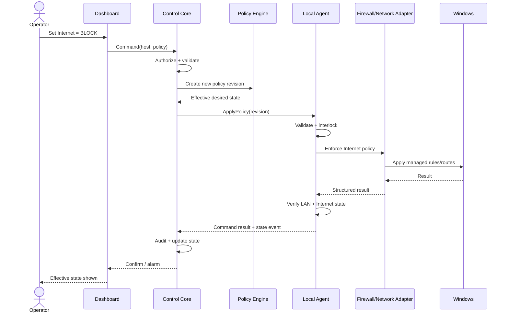

## 6. Sequence — Scheduled Access Transition

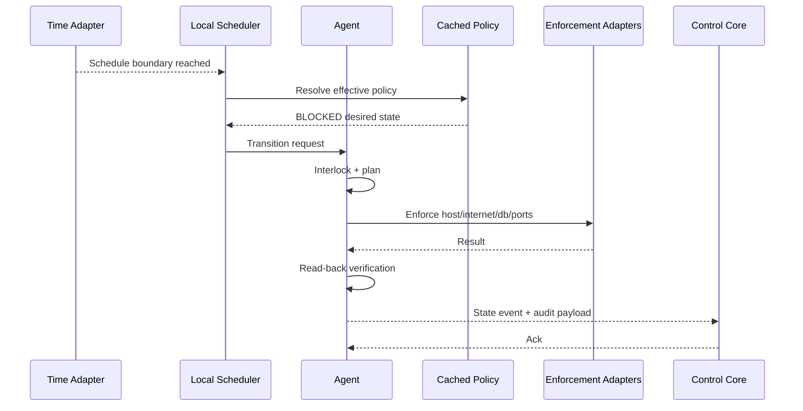

## 7. Sequence — Agent Reconnect

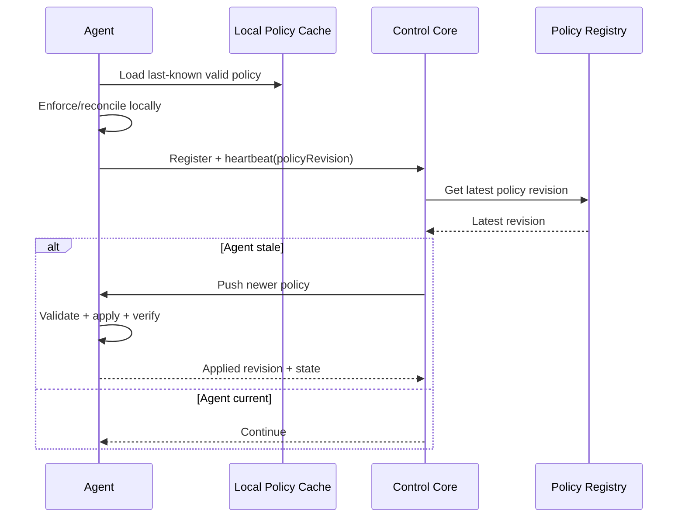

## 8. State Diagram — Host Access

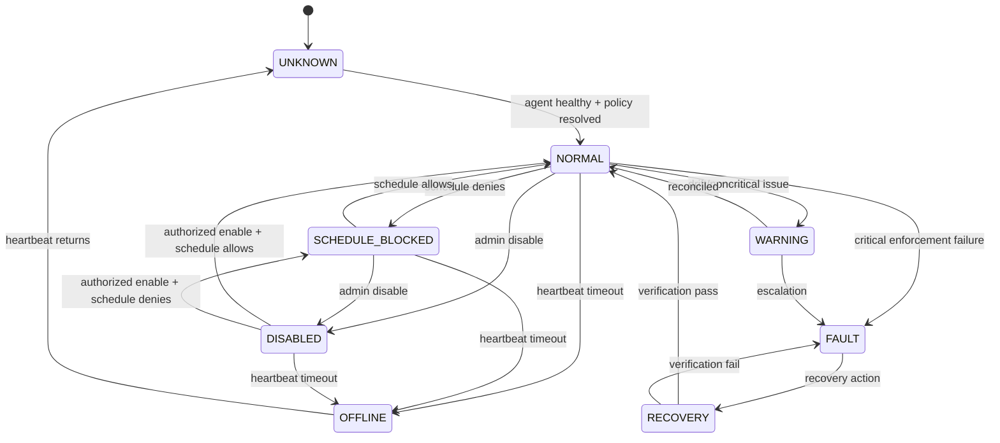

## 9. State Diagram — DB Server

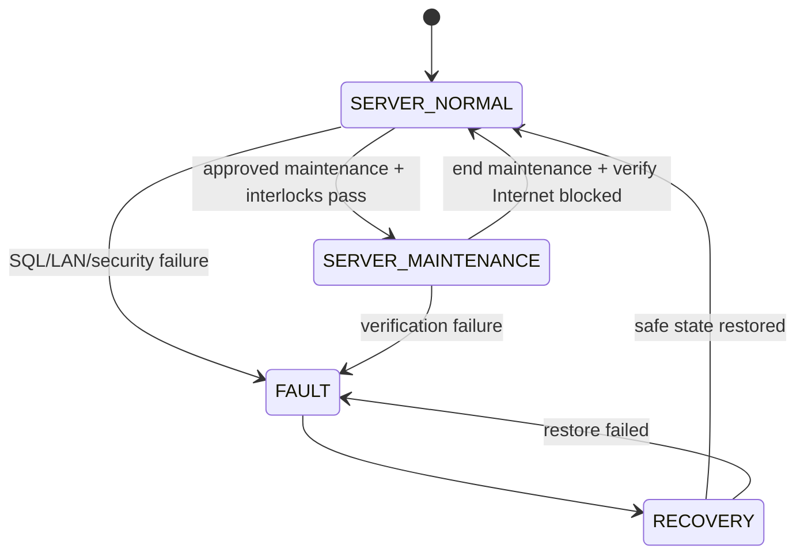

## 10. Activity — Reconciliation Loop

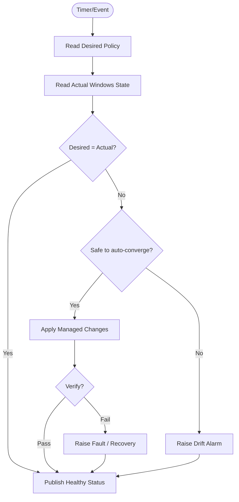

## 11. Deployment View

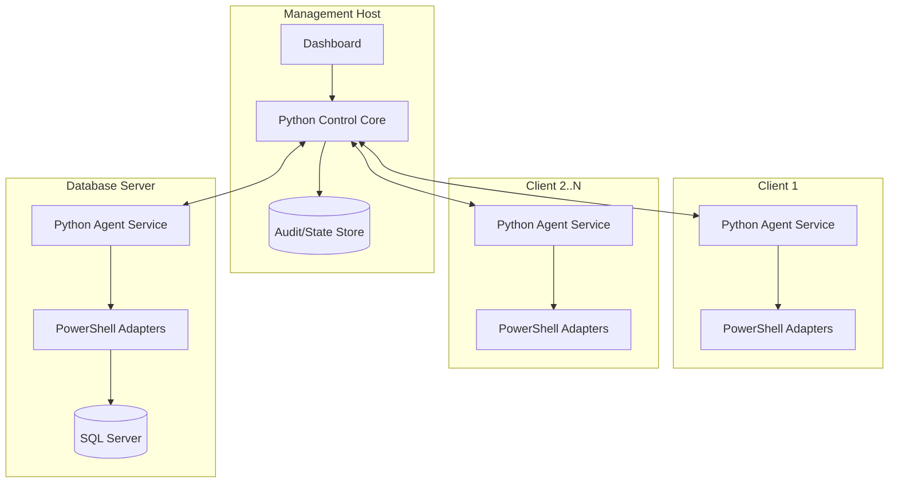

## 12. Alarm Flow

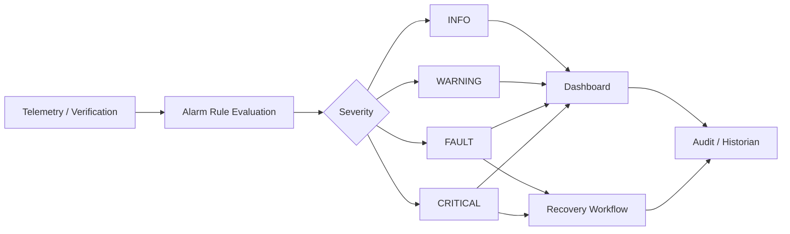
